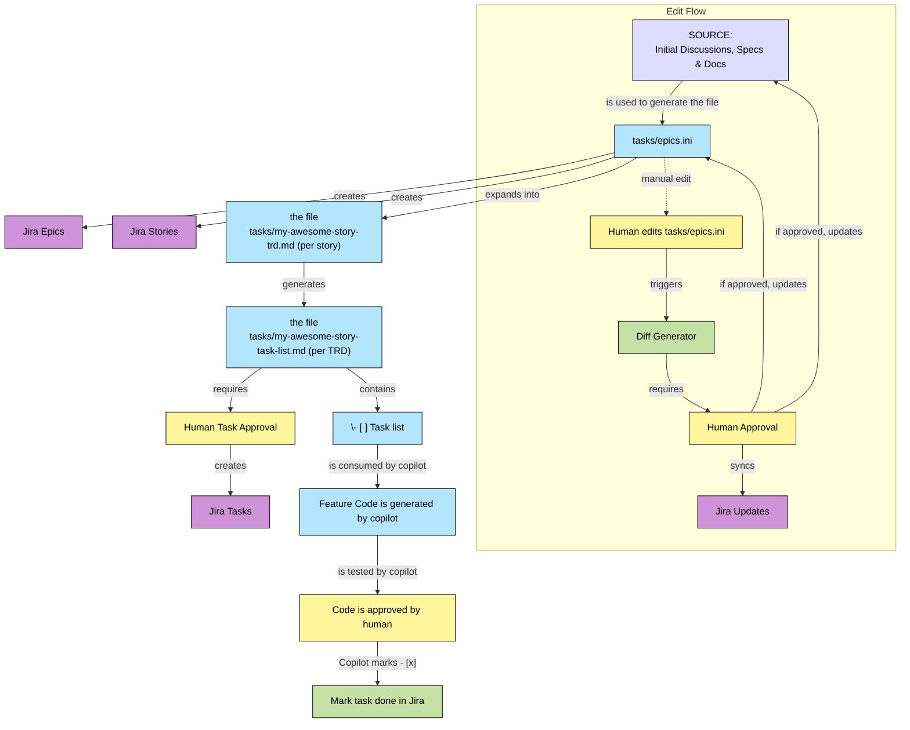

# 🌈 Happy Flow: DAKSH System

```mermaid
flowchart TD

  A["SOURCE:<br>Initial Discussions, Specs & Docs"]:::input -->|is used to generate the file| B["tasks/epics.ini"]:::artifact
  click B "../../../implementation/agents/epic-creator/" "View Epic Creator Doc"
  B -->|creates| JIRA_EPICS["Jira Epics"]:::external
  B -->|creates| JIRA_STORIES["Jira Stories"]:::external

  B -->|expands into| C["the file<br>tasks/my-awesome-story-trd.md (per story)"]:::artifact
  C -->|generates| D["the file<br>tasks/my-awesome-story-task-list.md (per TRD)"]:::artifact
  D -->|requires| TASK_APPROVAL["Human Task Approval"]:::manual
  TASK_APPROVAL -->|creates| JIRA_TASKS["Jira Tasks"]:::external

  D -->|contains| TASK_CHECKBOXES["\- [ ] Task list"]:::artifact
  TASK_CHECKBOXES -->|is consumed by copilot| CODE["Feature Code is generated by copilot"]:::artifact
  CODE -->|is tested by copilot| CODE_APPROVED["Code is approved by human"]:::manual
  CODE_APPROVED -->|"Copilot marks - [x]"| JIRA_DONE["Mark task done in Jira"]:::logic

  subgraph Edit Flow
    B -.->|manual edit| EDIT_UI["Human edits tasks/epics.ini"]:::manual
    EDIT_UI -->|triggers| DIFF["Diff Generator"]:::logic
    DIFF -->|requires| APPROVAL["Human Approval"]:::manual
    APPROVAL -->|if approved, updates| B
    APPROVAL -->|if approved, updates| A
    APPROVAL -->|syncs| JIRA_UPDATES["Jira Updates"]:::external
  end

  classDef input fill:#DDF,stroke:#000,color:#000;
  classDef artifact fill:#B3E5FC,stroke:#000,color:#000;
  classDef manual fill:#FFF59D,stroke:#000,color:#000;
  classDef logic fill:#C5E1A5,stroke:#000,color:#000;
  classDef external fill:#CE93D8,stroke:#000,color:#000;
```